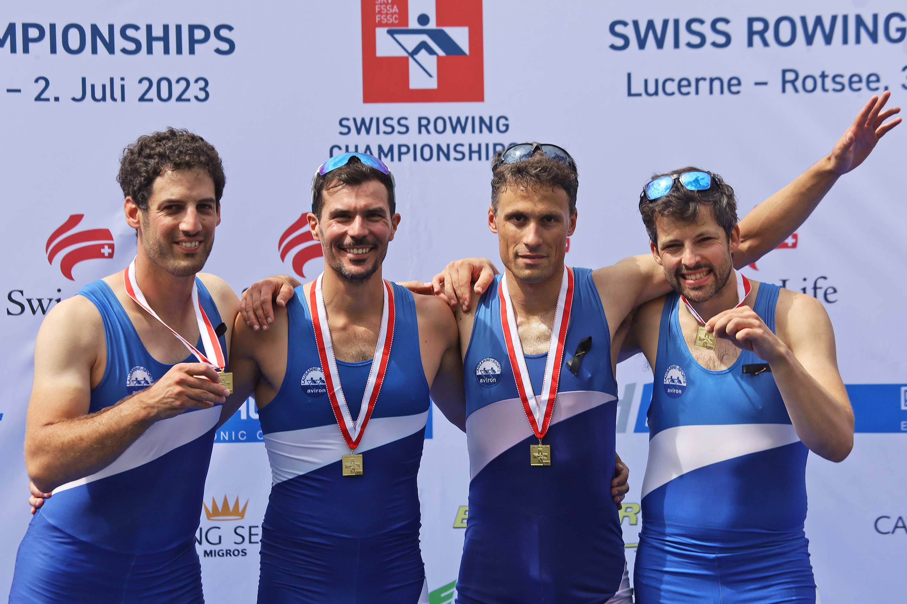

:bdg-link-primary:`Google Scholar <https://scholar.google.ch/citations?user=e5yVf8AAAAAJ&hl=en>`
:bdg-link-primary:`ORCiD <https://orcid.org/0000-0002-1694-3375>`
:bdg-link-primary:`GitHub <https://github.com/tdegeus>`

****************
Other activities
****************

.. |br| raw:: html

    

Tour du Léman
-------------

`Tour du Léman <https://bcge.tourduleman.ch>`_ |br|
Longest row race in the world on closed water |br|
Geneva, Switzerland |br|
09.2022 |br|
09.2023

.. raw:: html

    <iframe width="560" height="315" src="https://www.youtube.com/embed/A2Q0HOdHb9I?si=pjld72aoJLUPEIAO" title="YouTube video player" frameborder="0" allow="accelerometer; autoplay; clipboard-write; encrypted-media; gyroscope; picture-in-picture; web-share" allowfullscreen></iframe>

Swiss Champions Rowing
----------------------

Swiss Champion Rowing, Master Men 4x |br|
Luzern, Switzerland |br|
07.2023

Bronze Medal Swiss Championships Rowing, Master Men 2x |br|
Luzern, Switzerland |br|
07.2021

Student jobs
------------

Tutor of high school students in physics and math |br|
Eindhoven area, The Netherlands |br|
09.2004 - 09.2008

Field hockey equipment commissioner (voluntary) |br|
Eindhoven area, The Netherlands |br|
09.2003 - 09.2007

Sales employee and driver for an industrial rental company, Boels rental |br|
Eindhoven area, The Netherlands |br|
09.2003 - 09.2007

Hospitality employee in the soccer stadium of PSV, for Maison van den Boer |br|
Eindhoven area, The Netherlands |br|
09.2001 - 09.2004
