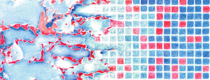

:bdg-link-primary:`Google Scholar <https://scholar.google.ch/citations?user=e5yVf8AAAAAJ&hl=en>`
:bdg-link-primary:`ORCiD <https://orcid.org/0000-0002-1694-3375>`
:bdg-link-primary:`GitHub <https://github.com/tdegeus>`

***********************
Education and positions
***********************

.. |br| raw:: html

    

Doctor of Philosophy
====================

Eindhoven University of Technology |br|
Mechanical Engineering |br|
`Cum Laude <https://www.tue.nl/en/university/departments/mechanical-engineering/news/04-05-2016-tom-de-geus-gaines-his-phd-cum-laude/>`_ |br|
2016

Master of Science
=================

Eindhoven University of Technology |br|
Mechanical Engineering |br|
With great appreciation (GPA 8.5/10) |br|
2012
