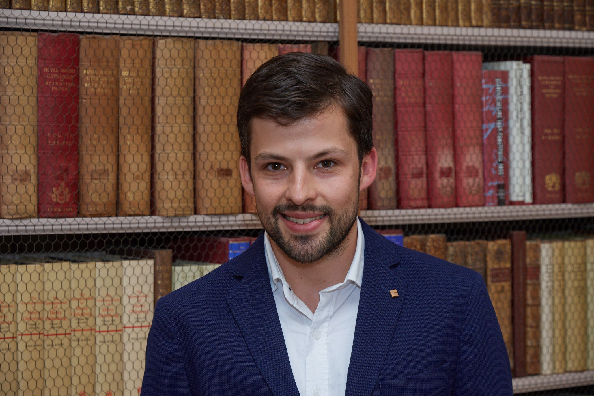

:bdg-link-primary:`Google Scholar <https://scholar.google.ch/citations?user=e5yVf8AAAAAJ&hl=en>`
:bdg-link-primary:`ORCiD <https://orcid.org/0000-0002-1694-3375>`
:bdg-link-primary:`GitHub <https://github.com/tdegeus>`

.. toctree::
   :maxdepth: 1
   :caption: Research

   research_creep.rst
   research_stick-slip.rst
   research_shear-band.rst
   research_excitations.rst
   research_fracture.rst
   research_fft.rst

.. toctree::
   :maxdepth: 1
   :caption: Career

   publications.rst
   conferences.rst
   prizes.rst
   students.rst
   teaching.rst
   education.rst
   activities.rst
   grants.rst

:octicon:`file;1em;sd-text-info`
:download:`CV <research/cv_short_en/main.pdf>`

:octicon:`file;1em;sd-text-info`
:download:`Academic CV <research/cv/main.pdf>`

.. toctree::
   :maxdepth: 1
   :caption: Programming

   software_mechanics.rst
   software_statistics.rst
   software_hpc.rst
   software_libraries.rst
   software_tips.rst

.. toctree::
   :maxdepth: 1
   :caption: Info

   contact.rst
