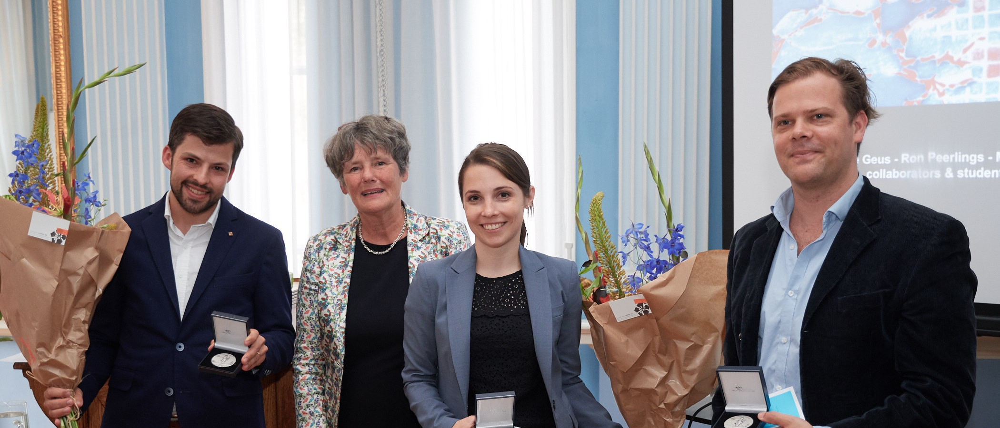
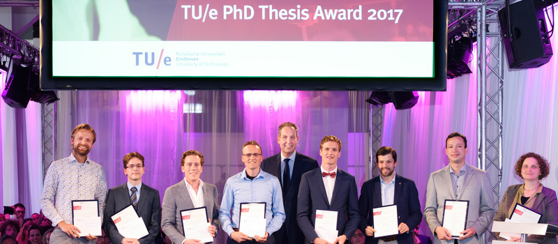

:bdg-link-primary:`Google Scholar <https://scholar.google.ch/citations?user=e5yVf8AAAAAJ&hl=en>`
:bdg-link-primary:`ORCiD <https://orcid.org/0000-0002-1694-3375>`
:bdg-link-primary:`GitHub <https://github.com/tdegeus>`

*****************
Prizes and Awards
*****************

.. |br| raw:: html

    

Prizes
======

Martinus van Marum award
------------------------

Award for best PhD thesis in the engineering sciences in a period of five years |br|
Koninklijke Hollandsche Maatschappij der Wetenschappen |br|
Royal Holland Society of Sciences and Humanities |br|
Prize: acceptance colloquium, a medal, and 12500 euro |br|
06.2017

.. dropdown:: Press releases

    **Tom de Geus (TUe) wint Martinus van Marum Prijs 2017 voor vernieuwend onderzoek naar tweefasenmaterialen**

    Dr. ir. Tom de Geus ontvangt de Martinus van Marum Prijs 2017 (12.500 euro) voor Ingenieurswetenschappen voor zijn dissertatie over tweefasenstaal ‘From damage to fracture, from micro to macro: a systematic study of ductile fracture in multi-phase microstructures’. Daarnaast publiceerde hij nog 12 artikelen. Hij promoveerde in mei 2016 bij Prof. dr. ir. M.G.D. Geers aan de Technische Universiteit Eindhoven aan de faculteit Werktuigbouwkunde. De prijs wordt uitgereikt bij de Koninklijke Hollandsche Maatschappij der Wetenschappen op vrijdag 16 juni 2017, om 15.30 uur in het prachtige Hodshon Huis, Spaarne 17 te Haarlem. Hier zal Tom de Geus ook zijn promotieonderzoek presenteren. Die middag worden tevens twee andere promotieprijzen uitgereikt, zie: `khmw.nl <http://www.khmw.nl>`_.

    Tweefasenstaal combineert het goede van twee soorten staal: het is sterk én vervormbaar. En daardoor zeer geschikt voor bijvoorbeeld de auto-industrie. Tom de Geus onderzocht wanneer dit staal stuk gaat en hoe het in dat opzicht verder te verbeteren is. Met alleen mechanische testen kom je maar langzaam verder in het oplossen van dergelijke complexe vraagstukken.
    De Geus koos daarom voor een totaal andere aanpak. Door middel van een computermodel deed hij miljoenen virtuele experimenten, waarbij hij 'wat gechargeerd' te werk ging om dit hoge aantal ‘experimenten’ te kunnen doen. Op basis van de vele data en hun gemiddelden kwam hij tot nieuwe inzichten. Zo ontdekte hij welk patroon van zachte en sterke korrels rond een gat terugkwam en dus welke configuratie van hard en zacht tot schade leidt. Daarnaast vond hij welke oriëntatie van deze zwakke plekken ten opzichte van elkaar bevordert dat het staal echt kapot gaat. Deze uitkomsten zijn waardevol voor de staalindustrie. Het levert een beter recept op voor het maken van sterker vervormbaar staal.

    Maar het unieke van dit promotieonderzoek is vooral de nieuwe onderzoeksmethode van De Geus. Door miljoenen numerieke experimenten uit te voeren en deze zelf ‘hun verhaal’ te laten vertellen, zonder uit te gaan van vooronderstellingen, kwam hij op objectieve wijze tot nieuwe inzichten.
    Op dit moment doet Tom de Geus met een beurs van NWO onderzoek naar wrijving, bij de École Polytechnique Fédérale de Lausanne (EPFL) in Zwitserland. Hier probeert hij met een vergelijkbare onderzoeksmethodiek tot nieuwe inzichten te komen in een relatief oud vakgebied.
    De dissertatie is te downloaden op: `geus.me/phd <http://www.geus.me/phd>`_

    **Over de Martinus van Marum Prijs**

    De Martinus van Marum Prijs is in 2008 ingesteld door de J.C. Ruigrok Stichting ter bekroning van promotieonderzoek op het gebied van de natuurwetenschappen en techniek, in één van de volgende disciplines: Exacte wetenschappen, Chemie en chemische technologie, Life sciences and technology, Milieuwetenschappen en Ingenieurswetenschappen (in 2017). De prijs is vernoemd naar Martinus van Marum, die als tweede secretaris van 1794 tot 1837 een stempel heeft gedrukt op de werkzaamheden van de KHMW. Hij heeft in Haarlem en ver daarbuiten grote bekendheid gekregen, vooral op het gebied van de natuurwetenschappen.

    Tekst: Janny Terlouw - `Terlouw & Schotman communicate <http://tscommunicatie.nl>`_

    Other coverage: `TU/e <https://www.tue.nl/en/university/departments/mechanical-engineering/news/26-04-2017-tom-de-geus-awarded-martinus-van-marus-award/>`_

Best PhD thesis
---------------

Best PhD thesis in Mechanical Engineering of the calendar year 2016. |br|
Eindhoven University of Technology (TU/e) |br|
Prize: 250 euro |br|
05.2017

Awards
======

7th ECCOMAS PhD Olympiad
------------------------

Winner of the 7th ECCOMAS PhD Olympiad |br|
Young Investigators Conference, Milan, Italy |br|
Award: 500 \euro |br|
09.2017

M2i poster award
----------------

Poster award for best innovative research value |br|
M2i annual research conference. |br|
Award: 250 \euro |br|
12.2016

M2i poster award
----------------

Poster award |br|
M2i annual research conference. |br|
Award: 250 \euro |br|
12.2013

Entrepreneurship award
----------------------

Entrepreneurship award for best business case |br|
Eindhoven University of Technology. Award: 1000 \euro |br|
02.2008
